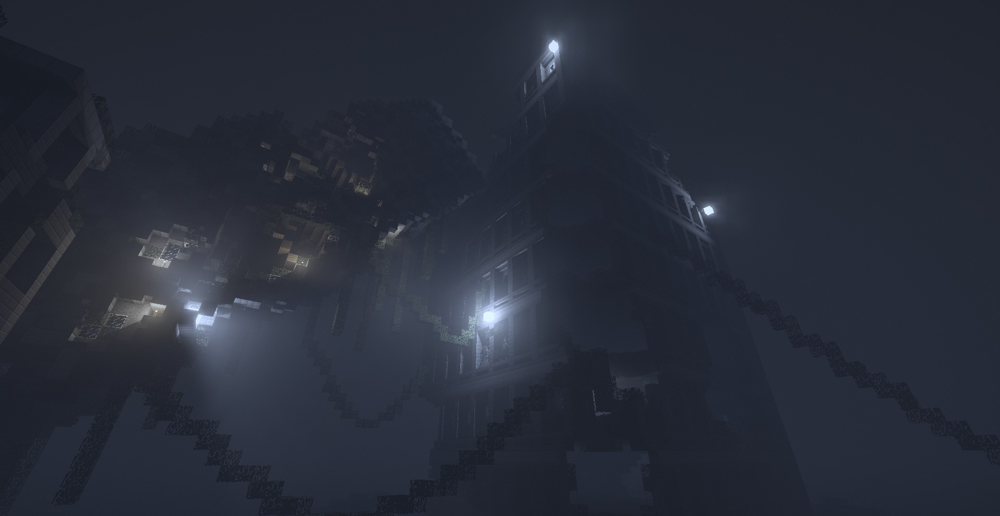
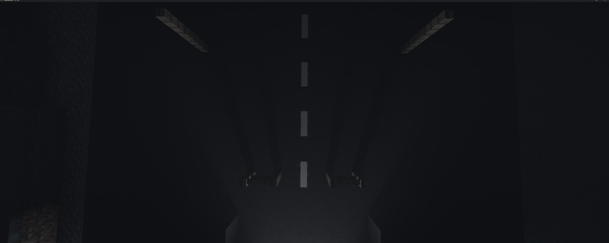
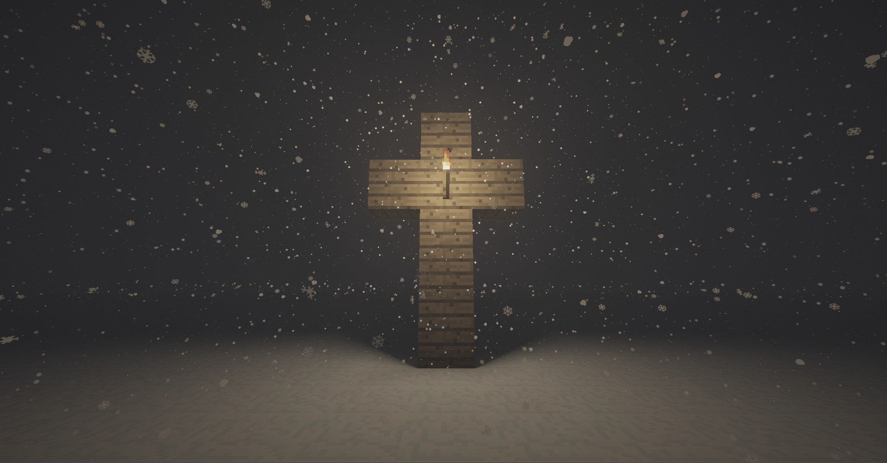
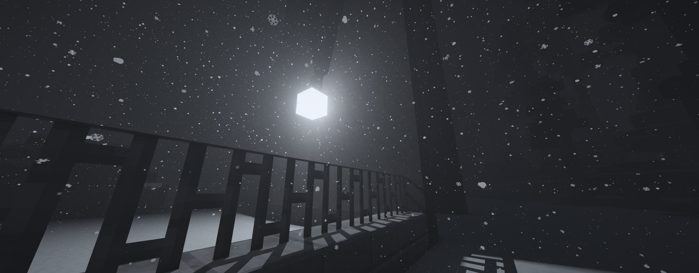

# Low Pressure Sodium Shaders

Site is a deferred rendering shader pack for Minecraft 1.7.10 on the Angelica engine. The renderer does not construct screen-space shadow maps or cascaded shadow maps. All occlusion, direct shadow attenuation, diffuse interreflection, and volumetric media are solved using a dynamic voxel occupancy field and analytical geometric tests evaluated on compute and deferred passes.

- Pipeline: deferred
- Target: MC 1.7.10
- Compatibility layer: Angelica 2.20+
- Minimum OGL: 4.3




## System Architecture

The pipeline uses an anchored local domain of 128x128x128 voxels centered on the integer camera position. Standard shadow map passes are repurposed for geometry injection into 3D textures and persistent storage buffers.

- Primary voxel grid: 128x128x128 unsigned integer image storing structural bitmasks
- Geometry storage: shader storage buffers containing player triangles, sub-block mesh descriptors, and 16x16 binary texture opacity masks
- Compute stages: five consecutive compute executions managing structural analysis, ray budget allocation, Monte Carlo photon emission, change tracking, and hemispherical sky evaluation
- Shading path: G-buffer geometry pass followed by screen-space horizon ambient occlusion, analytical deferred shading, volumetric marching, and composite post-processing

## Scene Voxelization

Voxelization operates conservatively across a 64-block bounding box surrounding the view origin:

- Full blocks: Axis-aligned block faces aligned with voxel boundaries update 6-bit directional face masks in the grid.
- Enclosed blocks: Voxels occluded from all sides are flagged as solid by structural neighbor passes, allowing early termination in ray marching.
- Sub-block geometry: Slabs, stairs, and plants that do not form continuous cubes are preserved as triangle records in a spatial buffer. Primitives with cutout textures query the atlas to generate a 16x16 bitmask of alpha coverage.
- Dynamic entities: Moving actors write conservative axis-aligned bounds directly into the voxel volume. The local player mesh is captured as camera-relative triangles into a dedicated uniform grid for exact edge tests.

## Direct Lighting and Analytical Visibility

Direct illumination from localized light sources evaluates visibility analytically rather than via stochastic ray sampling.

### Analytical Cone Tracing

Light sources possess an effective physical radius `R`. At distance `L` from the receiver, the projected angular radius ratio is:

```
k = R / L
```

A ray step between distances `t0` and `t1` defines a conical frustum of radius `k * t`. Solid voxel boundaries project coverage based on transverse distance `d` to the ray axis:

```
Coverage = clamp(0.5 - 0.5 * (d / (k * t)), 0.0, 1.0)
```




The lower envelope of interior and exterior corner gaps is evaluated per cell crossing. If the cone intersects an adjacent block corner, visibility decreases proportionally without producing stepped discretization artifacts.

### Planar Rectangle Integration

Consecutive triangles of partial blocks are merged during pre-passes into coplanar axis-aligned rectangles. Occlusion for a rectangle across the light disc is integrated using homogeneous coordinates:

- Source coordinates map the receiver as the projection center.
- Lateral displacements divide by cone slope `k`.
- Rectangle edges are clipped to the disc boundary using radial distance normal forms.
- Disjoint triangle areas are summed directly, preventing overestimation on thin elements such as iron bars or fences.

## Indirect Lighting and Guided Path Transport

Indirect block light is evaluated as an irradiance volume updated every frame by compute passes.

### Guided Photon Emission

Emitters distribute photon paths based on adaptive directional learning:

- Octahedral quadtree: Maps the directional sphere onto a unit square through an equal-area octahedral projection. Nodes maintain fractional flux weights. Nodes exceeding split thresholds subdivide, while stagnant nodes collapse.
- Von Mises-Fisher mixtures: Computes six lobes aligned with coordinate axes. Directional samples accumulate via atomic vectors. For mean direction length `r`, dispersion parameter `kappa` is derived as:

```
kappa = min(r * (3.0 - r * r) / (1.0 - r * r), KappaMax)
```

Sampling directions from these distributions focuses ray energy into visible portals, doors, and corridors.

### Adjoint-Driven Russian Roulette and Splitting (ADRRS)

Each bounce path carries spectral flux `Phi`. The local importance `A` of the path relative to camera position `c` and forward view vector `v` is:

```
d = x - c
W_dist = 1.0 / (1.0 + dot(d, d) / (FocusDistance * FocusDistance))
W_dir = mix(BehindWeight, 1.0, smoothstep(-0.5, 0.5, dot(normalize(d), v)))
A = W_dist * W_dir
q = (luminance(Phi) / ReferenceFlux) * A * Gain
```

Paths branch based on `q`:
- `q < 1.0`: Survives with probability `s = max(q, MinSurvival)`. Flux divides by `s` on survival; otherwise, the path terminates.
- `q >= 1.0`: Path splits into `N = min(int(q), MaxSplit)` independent branches. Each branch carries `Phi / N` and samples a distinct cosine-weighted reflection vector.

Deposited radiance is written to 32-bit fixed-point integer images and transferred to 16-bit floating-point textures via temporal exponential moving averages.

## Ambient Occlusion and Sky Exposure

Sky illumination combines screen-space and volumetric occlusion techniques:

- Ground-Truth Ambient Occlusion (GTAO): Evaluates view-space horizons across multiple radial screen slices. Inner horizon angles are integrated analytically over the projected normal plane, generating micro-occlusion on high-frequency geometric detail.
- Voxel sky exposure: Air cells within reach of occluders cast cosine-distributed rays toward the upper hemisphere during compute passes. Each cell accumulates directional moments:

```
M_dir = sum(omega * cos(theta)) / TotalRays
M_vis = sum(cos(theta)) / TotalRays
```

Surfaces sample nearby cells trilinearly. Surface normal `N` reconstructs the unobstructed sky factor:

```
SkyVisibility = (0.25 * M_vis + 0.5 * dot(M_dir, N)) / (0.25 + max(N.y, 0.0) / 3.0)
```

## Participating Media and Atmospheric Transport

Atmospheric scattering handles uniform distance mist, ground height fog, and volumetric block light scattering:

- Height fog extinction: Integrates an exponential density profile along the view ray:

```
Depth = d0 * exp(-k * (ro.y - FogHeight)) * (1.0 - exp(-k * rd.y * dist)) / (k * rd.y)
```

- Volumetric block light: Rays marched across the view path sample the dual-buffered 3D volumetric light field. Angular scattering uses the Henyey-Greenstein phase function governed by mean photon transport vectors stored during the compute phase:

```
Phase = (1.0 - g * g) / pow(1.0 + g * g - 2.0 * g * dot(FlowVector, -rd), 1.5)
```

- Atmospheric snowfall: Near-camera precipitation marches two offset procedural volumetric lattices. Flakes rotate in the screen plane and deform based on aerodynamic shear, settling speed, and wind gust vectors. Distant precipitation transitions into an analytical extinction veil.

## Surface Materials

Block attributes are decoded into surface parameters based on identity categories:

- Roughness: Dictates microfacet distribution width and specular falloff.
- Reflectance (f0): Base normal-incidence Fresnel reflectance.
- Porosity: Determines liquid absorption. High porosity darkens albedo when wet while suppressing specular mirror reflection.

## Post-Processing

- Volumetric bilateral filter: In-scattered light is filtered using a 4x4 spatial box weighted by linear depth discrepancies to preserve geometry boundaries.
- Bloom: High-luminance pixels above threshold values downsample across five mipmap levels. Each level blurs using a five-tap tent filter before additive synthesis.
- Tone mapping: Linear HDR values scale by exposure and compress via rational shoulder curve mapping before conversion to sRGB space.
- Sensor simulation: Dynamic gradient noise introduces grain across dark areas, accompanied by mild chromatic balance shifts toward cold tints.

